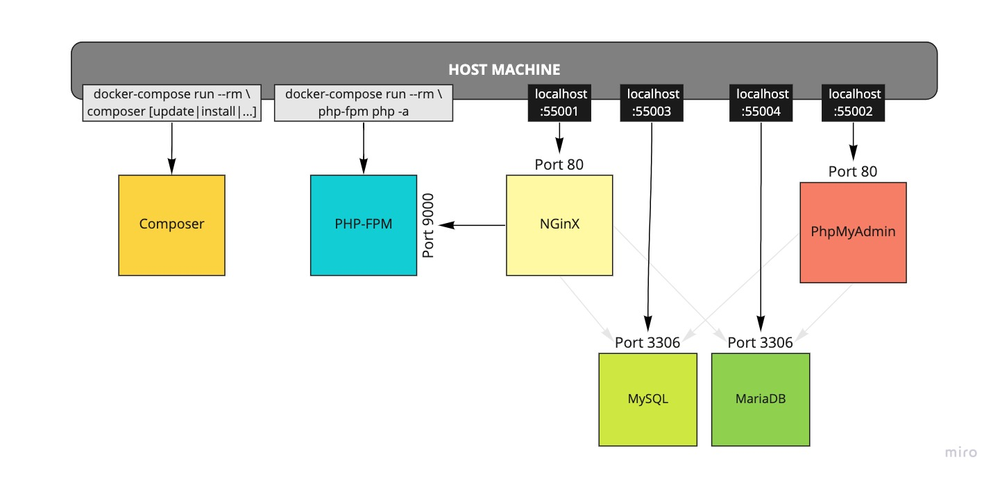

Demo Project

Containerized environment consisting of the following containers:
( All versions can be easily adapted! )
- NGinX
- PHP-FPM v7.4
- MariaDB v10   
- MySQL v8   
- Composer v2
- PhpMyAdmin v5

### Set Up
1. Ensure [Docker is installed](https://www.docker.com/products/docker-desktop) on your machine
1. copy the .env file and configure it to your liking: `cp .env.example .env`
1. run `docker-compose up`
1. the first installation can take about a minute or two (ymmv depending on network and CPU power)
1. During the first run, the database will output the root password to STDOUT. If you need it, note it down!
1. During the first run, the database will also be seeded with the base-structure as well as some sample data. 
   If you don't want this to happen, feel free to simply delete the respective *.sql files in: 
   - `.docker/mysql/docker-entrypoint-initdb.d`
   - `.docker/mariadb/docker-entrypoint-initdb.d`
   
### Changing the PHP version
To change the PHP version, update the image tag in the `.docker/php-fpm/Dockerfile` as well the one for composer
in the `docker-compose.yml`. Both need to match the same version, otherwise composer can behave quite oddly at times!
After changing the version, you need to run `docker-compose up --build` to ensure the php-fpm container is updated.
- update line 1 of file `.docker/php-fpm/Dockerfile`, e.g. `FROM php:7.4-fpm` --> `FROM php:8.0-fpm`
- update composer image-tag in file `docker-compose.yml`, e.g. `prooph/composer:7.4` --> `prooph/composer:8.0`
- stop containers if not already done: `docker-compose stop`
- rebuild php-fpm container `docker-compose up --build`

### Working with this setup
1. If you need to run composer commands, you can run them through the composer-container to ensure not to run 
   into php-version-conflicts in case you have a different PHP version on your host machine 
   (avoiding "But it works on my machine!" problems). This can be done explicitly (more verbose)
   via `docker-compose run --rm composer` or you can use the provided script: `./composer`.
    - `./composer update`
    - `./composer install`
    - `./composer require nyholm/psr7-server`
    - etc.
1. If you need to execute PHP scripts, you can run them through a copy of the php-fpm container for the same reasons
   as mentioned above via `docker-compose run --rm php-fpm php` or you can use the provided script: `./php`.
   The environment variables are already injected.
    - `./php -a`
    - `./php artisan tinker`
    - etc.
1. To run all containers in the background, run `docker-compose up -d` and to look into the logs
   run 'docker-compose logs'. To stop the running containers, run `docker-compose stop`.
1. To stop and delete all containers related to this project, just run `docker-compose down`. 
   If you also want to wipe the images from your disk, you can use the wrecking-ball method 
   and run `docker system prune -a` but be aware that this will remove all stopped containers, 
   networks, images, etc from your system, even the ones not related to this project!
1. If you stop and/or delete the containers of this project, 
   you don't lose anything as long as you keep the `./.docker/**/db_persistence` folders intact.
1. For a really fresh install, stop and remove all containers with `docker-compose down` and wipe the database and 
   php-dependencies: `rm -fr .docker/mariadb/db_persistence/* .docker/mysql/db_persistence/* src/vendor`. 
   Then you can run `docker-compose up --build` again and will receive a very fresh environment 
   with new database (and new DB root password). 
