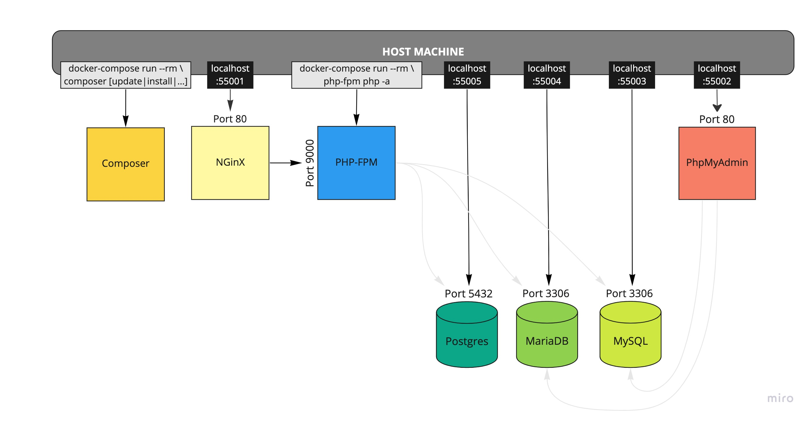

Demo Project

Containerized environment consisting of the following containers:
( All versions can be easily adapted! )
- NGinX
- PHP-FPM v8.0
- MariaDB v10   
- MySQL v8   
- Composer v2
- PhpMyAdmin v5



### Using the Makefile
For simplicity's sake, we have added a small wrapper around Make. This allows us to pass arguments and flags to the 
respective commands the idiomatic way. If you don't like using `./make` instead of just `make`, you can add this 
one-liner to your `.bashrc` or `.bash_profile`:
```bash
function make(){ if [ -f ./make ]; then ./make $@; else make $@; fi }
```

### Set Up
1. Ensure [Docker is installed](https://www.docker.com/products/docker-desktop) on your machine
2. Run `./make up`
3. The first installation can take about a minute or two (ymmv depending on network and CPU power)
4. During the first run, the `.env.example` will be copied to `.env`.
5. After the DBs have spun up, you will find the root-passwords in your `.env` file (in case you need them). 
6. During the first run, the database will also be seeded with the base-structure as well as some sample data. 
   If you don't want this to happen, feel free to simply delete the respective *.sql files in:
   - `.docker/mysql/docker-entrypoint-initdb.d`
   - `.docker/mariadb/docker-entrypoint-initdb.d`
   
### Changing the PHP version
To change the PHP version, update the image tag in the `.docker/php-fpm/Dockerfile` as well the one for composer
in the `.docker/docker-compose.yml`. Both need to match the same version, otherwise composer could behave quite
oddly at times! After changing the version, you need to run `./make dc up --build` to ensure the php-fpm container
is updated.
- update line 1 of file `.docker/php-fpm/Dockerfile`, e.g. `FROM php:8.0-fpm` --> `FROM php:8.1-fpm`
- update composer image-tag in file `.docker/docker-compose.yml`, e.g. `prooph/composer:8.0` --> `prooph/composer:8.1`
- stop containers if not already done: `./make dc stop`
- rebuild php-fpm container `./make dc up --build`

### Working with this setup
1. If you need to run composer commands, you can run them through the composer-container to ensure not to run
   into php-version-conflicts in case you have a different PHP version on your host machine
   (avoiding "But it works on my machine!" problems). This can be done like so:
    - `./make composer update`
    - `./make composer install`
    - `./make composer require nyholm/psr7-server`
    - etc.
2. If you need to execute PHP scripts, you can run them through a copy of the php-fpm container for the same reasons
   as mentioned above like this (the environment variables are already injected):
    - `./make php -a`
    - `./make php artisan tinker`
    - etc.
3. The same works for `docker-compose`, e.g.: `./make docker-compose ps --all` or for short: `./make dc ps --all`
4. To run all containers in the background, run `./make dc up -d` and to look into the logs
   run `./make dc logs`. To stop the running containers, run `./make dc stop`.
5. To stop and delete all containers related to this project, just run `./make dc down`.
   If you also want to wipe the images from your disk, you can use the wrecking-ball method
   and run `docker system prune -a` but be aware that this will remove all stopped containers,
   networks, images, etc from your system, even the ones not related to this project!
6. If you stop and/or delete the containers of this project,
   you don't lose anything as long as you keep the `./.docker/**/db_persistence` folders intact.
   To wipe the DBs, use the command `./make wipe_db`.
7. For a really fresh install, stop and remove all containers, db persistence, composer dependencies and env variables
   using the `./make clean` command followed by a fresh `./make up`.
